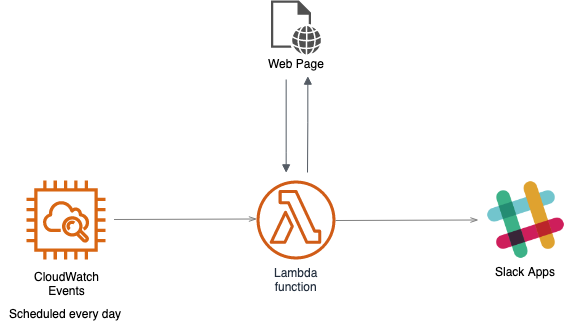

# Scraping Service

特定のWebページをスクレイピングし、結果をSlackへ送信する。
現状はマネーフォワードMEに対応している。



## Getting Started

1. bundle install
```
$ cd src
$ bundle install --deployment
```

2. ソースコードのzip化、アップロード(s3バケットは事前に作っておく)
```
$ cd ..
$ sam package \
    --template-file template.yaml \
    --output-template-file serverless-output.yaml \
    --s3-bucket { your-bucket-name }
```

3. デプロイ
```
$ sam deploy \
    --template-file serverless-output.yaml \
    --stack-name { your-stack-name } \
    --capabilities CAPABILITY_IAM
```

## ローカルでのデバッグ
sam localでローカルでの実行が可能。
```
$ sam local invoke ScrapingService --no-event
```
